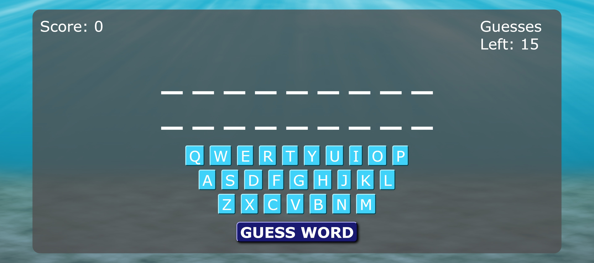

## Sea Animal Guessing Game

### Overview

A browser game that uses HTML, CSS, JavaScript within the Bootstrap CSS Framework.

### How to Play

The player can press the on-screen buttons or use a keyboard to guess letters in a given mystery word.  The player has a limited number of letters they can guess before they get a game over.  If the player thinks they know the word, they can submit their guess via a prompt.  Upon a correct guess, a score will be calculated based on how many letters were guessed.   
